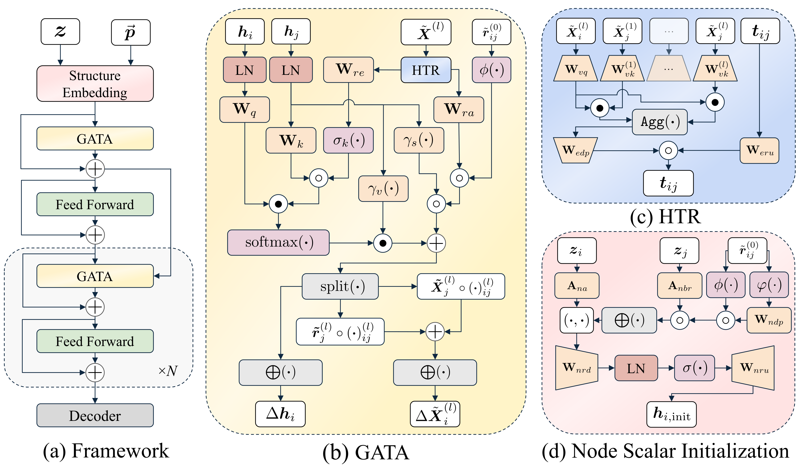

# GotenNet: Rethinking Efficient 3D Equivariant Graph Neural Networks

<div align="center">

[](https://openreview.net/pdf?id=5wxCQDtbMo)
[](https://www.sarpaykent.com/publications/gotennet/)
[](LICENSE)
[](https://pytorch.org/)

</div>

<p align="center">
  
</p>

## Overview

This is the official implementation of **"GotenNet: Rethinking Efficient 3D Equivariant Graph Neural Networks"** published at ICLR 2025.

GotenNet introduces a novel framework for modeling 3D molecular structures that achieves state-of-the-art performance while maintaining computational efficiency. Our approach balances expressiveness and efficiency through innovative tensor-based representations and attention mechanisms.

## ✨ Key Features

- 🔄 **Effective Geometric Tensor Representations**: Leverages geometric tensors without relying on irreducible representations or Clebsch-Gordan transforms
- 🧩 **Unified Structural Embedding**: Introduces geometry-aware tensor attention for improved molecular representation
- 📊 **Hierarchical Tensor Refinement**: Implements a flexible and efficient representation scheme
- 🏆 **State-of-the-Art Performance**: Achieves superior results on QM9, rMD17, MD22, and Molecule3D datasets

## 🚀 Installation

### 🔧 From Source

```bash
git clone https://github.com/sarpaykent/gotennet.git
cd gotennet
```

#### Using pip with conda

```bash
conda create -n gotennet python=3.10
conda activate gotennet
pip install -r requirements.txt
pip install -e .
```

#### Using uv

```bash
uv venv --python 3.10
source .venv/bin/activate
uv pip install -r requirements.txt
uv pip install -e .
```

## 🔬 Usage

### Training a Model

After installation, you can use the `train_gotennet` command:

```bash
train_gotennet
```

Or you can run the training script directly:

```bash
python gotennet/scripts/train.py
```

Both methods use Hydra for configuration. You can reproduce U0 target prediction on the QM9 dataset with the following command:

```bash
train_gotennet experiment=qm9_u0.yaml
```

### Configuration

The project uses [Hydra](https://hydra.cc/) for configuration management. Configuration files are located in the `configs/` directory.

Main configuration categories:
- `datamodule`: Dataset configurations (md17, qm9, etc.)
- `model`: Model configurations
- `trainer`: Training parameters
- `callbacks`: Callback configurations
- `logger`: Logging configurations

## 🤝 Contributing

We welcome contributions to GotenNet! Please feel free to submit a Pull Request.


## 📚 Citation

Please consider citing our work below if this project is helpful:


```bibtex
@inproceedings{aykent2025gotennet,
  author = {Aykent, Sarp and Xia, Tian},
  booktitle = {The Thirteenth International Conference on LearningRepresentations},
  year = {2025},
  title = {{GotenNet: Rethinking Efficient 3D Equivariant Graph Neural Networks}},
  url = {https://openreview.net/forum?id=5wxCQDtbMo},
  howpublished = {https://openreview.net/forum?id=5wxCQDtbMo},
}
```

## 📄 License

This project is licensed under the MIT License - see the [LICENSE](LICENSE) file for details.

## Acknowledgements

GotenNet is proudly built on the innovative foundations provided by the projects below.
- [e3nn](https://github.com/e3nn/e3nn)
- [PyG](https://github.com/pyg-team/pytorch_geometric)
- [PyTorch Lightning](https://github.com/Lightning-AI/pytorch-lightning)
